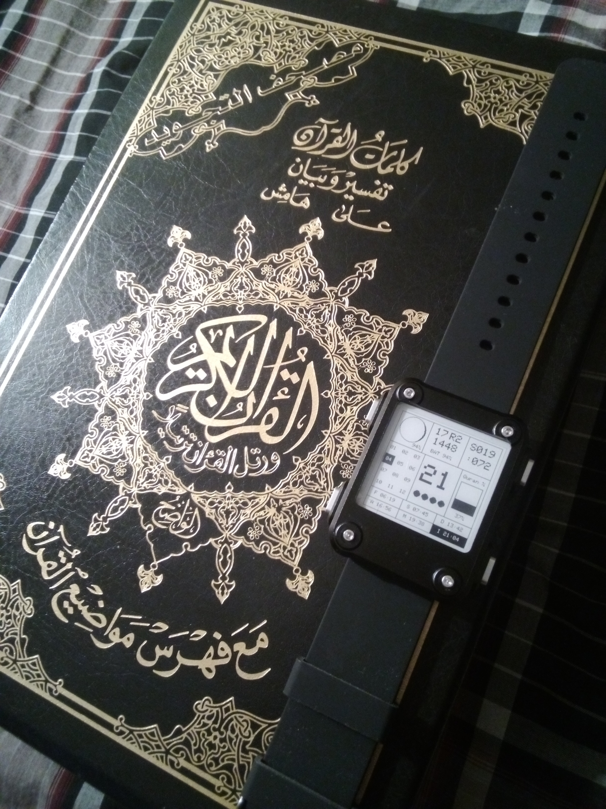
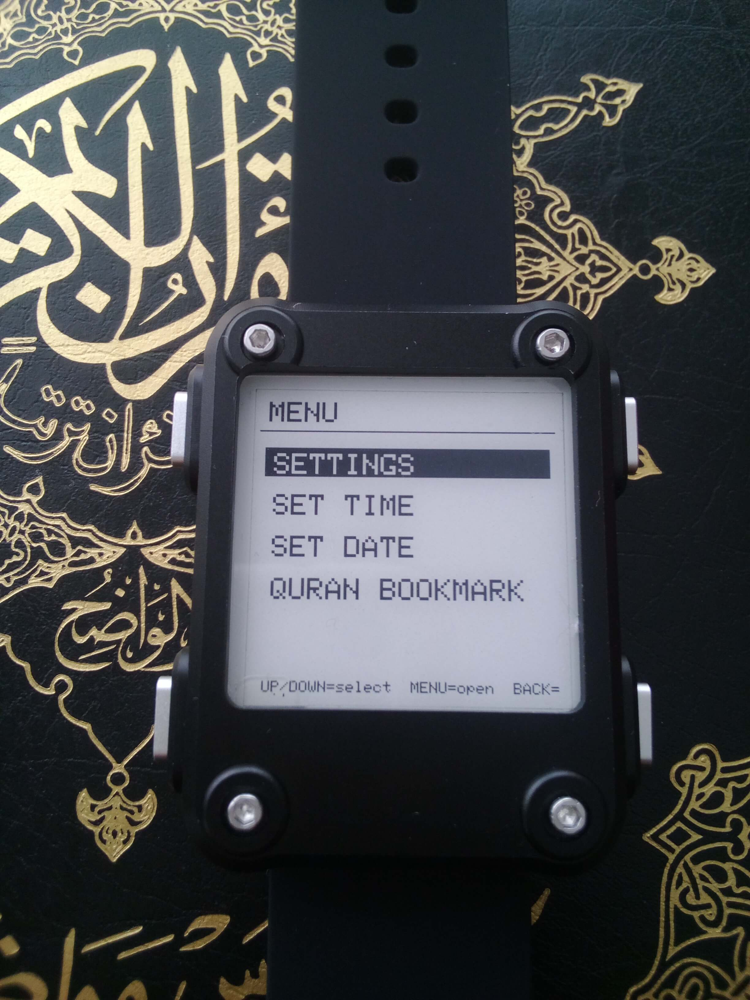
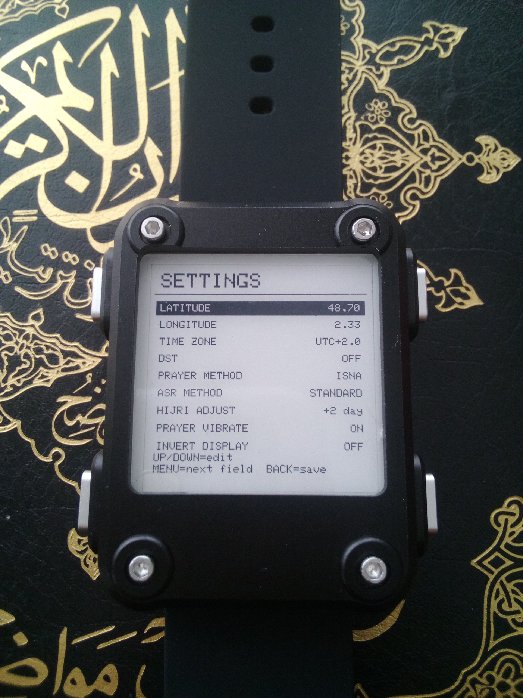
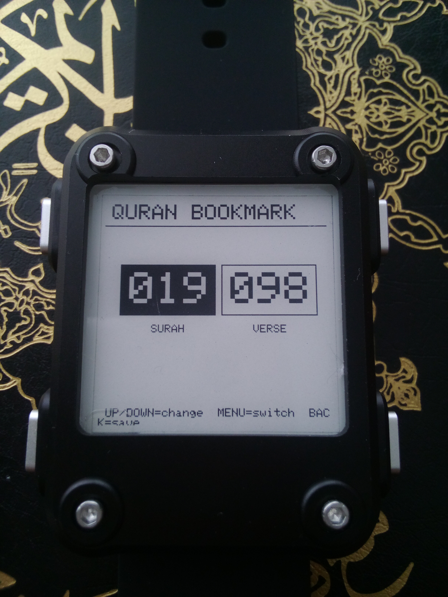

# QuranWatch

<p align="center">
  
</p>

**A prayer-times, Hijri-calendar and Quran-reading-tracker watch face for the Watchy e-paper smartwatch.**

QuranWatch turns a Watchy (v2 and compatible [clones](https://github.com/Szybet/WatchySourcingHub) into a dedicated companion for daily worship. Everything is computed on the watch itself. It needs no phone, no Wi-Fi and no account, and it shows only numbers and short abbreviations, so it is not tied to any interface language.

```
+--------+----------------+----------+
| Moon   |  27 Ram        |  S011    |
| phase  |  1448          |  :036    |
|  96%   |  BAT 91%       |          |
+--------+----------------+----------+
| 01 02 03|      14       | Quran %  |
| 04 05 06|     ●●○○      |  ████    |
| 07 08 09|               |  ████    |
|[10]11 12|               |  42%     |
+--------+----------------+----------+
|[F 06:19]| S 07:46 | D 13:05        |
| A 15:51 | M 18:22 | I 19:49        |
+--------------------------------------+
```
*(brackets `[...]` mark cells shown inverted - white on black - on the real screen: the current Hijri month and the current prayer)*

## Why QuranWatch

- **Fully offline.** Prayer times, the Hijri date and the moon phase are calculated on the watch from your coordinates and the date. Nothing is fetched from the internet.
- **Everything at a glance.** Nine information zones fit on the 200×200 screen: moon phase, Hijri date, battery, Quran bookmark, hour, Hijri month grid, reading progress and the five daily prayers plus sunrise.
- **Set up entirely on the watch.** Latitude, longitude, time zone, DST, prayer method, Asr method, Hijri correction, prayer vibration, display inversion, time, date and bookmark are all edited with the four buttons through a simple menu. No companion app, no reflashing to change a setting.
- **Fast, accelerating navigation.** Latitude, longitude, hour, minute, day, month, year, surah and verse all step by a small amount on a tap and jump by larger increments the longer you hold the button, so reaching a distant value takes seconds, not hundreds of presses.
- **Works on Watchy clones.** Time and date are stored as an offset in flash and the RTC chip is never written, which avoids write problems seen on some Watchy v2 clones. A software display-inversion option is also available for clones whose e-paper controller doesn't support the hardware invert command.
- **Vibration at prayer time (optional).** The watch gives a short double pulse (100 ms on, 120 ms off, 100 ms on) at Fajr, Dhuhr, Asr, Maghrib and Isha. Can be switched off in Settings.
- **Low-battery warning.** Below a configurable threshold (9% by default), the battery line inverts with a "!" and the watch vibrates SOS in Morse code, repeated at most every 30 minutes.
- **E-paper readability.** High contrast, always on, and readable in sunlight. The current Hijri month and the current prayer are each shown as an inverted (white-on-black) cell rather than an outline, for a clearer at-a-glance read.
- **Maintainable code.** The project is split into small single-purpose files (prayer times, Hijri calendar, moon, Quran data, storage, UI, input), so changes stay local.

<p align="center">
  
</p>

## Features

### Prayer times
- Fajr, sunrise (S), Dhuhr, Asr, Maghrib and Isha, shown in a 2×3 grid.
- Calculated from the sun's position (equation of time, declination and hour angle) for your latitude and longitude.
- Calculation methods: **MWL, ISNA, Egyptian, Karachi, Umm al-Qura, Tehran, JAKIM, Moonsighting Committee (fixed-angle approximation), UOIF (12°/12°)**.
- Asr method: **Standard (Shafi/Maliki/Hanbali)** or **Hanafi**.
- The current prayer's cell is shown inverted (white text on a black cell).
- Optional vibration at Fajr, Dhuhr, Asr, Maghrib and Isha (not at sunrise), once per prayer per day.

### Hijri calendar
- A 12-month grid (01 to 12), with the **current Hijri month shown as an inverted cell**.
- The information zone shows the Hijri day with a month abbreviation (Muh, Saf, R1, R2, J1, J2, Raj, Sha, Ram, Shw, DQ, DH) and the Hijri year, both centered.
- Manual correction of −3 to +3 days to align with your local moon-sighting authority.

### Moon phase
- Drawn mathematically, with no bitmaps, using the Meeus phase-angle formulas (accurate to a fraction of a percent day after day - more accurate than a plain mean-synodic-month estimate).
- The illuminated side is drawn white and the dark side black, with a black outline; the percentage is shown in the corner of the zone.

### Quran reading tracker
- A bookmark stored as **surah:verse**. No names and no text are displayed.
- A single "Quran %" progress bar shows overall progress through the whole Quran (6,236 verses), reached by the bookmark.
- Edited on the watch via the main menu, or by holding MENU for 3 seconds from the watch face for a direct shortcut.

### Clock
- The hour is shown large, with four dots underneath marking the quarter-hour: already-passed quarters are solid, the current quarter is a ring (black with a white center), upcoming quarters are outlined only.

### Time, date and settings - all on the watch
- **Time and date** are set from the main menu. To stay compatible with Watchy clones whose RTC write path can misbehave, the RTC chip itself is never written: the displayed time is the RTC's own time plus a correction offset stored in flash.
- **Settings** covers latitude, longitude, time zone, DST, prayer method, Asr method, Hijri adjustment, prayer vibration on/off, and display inversion on/off.
- **Display inversion** is a software option (not the e-paper controller's hardware command, which some clones ignore) - every draw call in the project goes through it, so toggling it flips the whole screen consistently.

<p align="center">
  
</p>

## Controls

| Button | On the watch face | In the main menu | Inside a screen |
|---|---|---|---|
| **MENU** (short press) | Open the main menu | Enter the highlighted item | Move to the next field |
| **MENU** (hold 3 s) | Jump straight to the Quran bookmark editor | - | - |
| **UP** | - | Move to the item above | Increase the current field (accelerates the longer you hold) |
| **DOWN** | - | Move to the item below | Decrease the current field (accelerates the longer you hold) |
| **BACK** | - | Return to the watch face | Save and return to the watch face |

The main menu has four entries: **SETTINGS**, **SET TIME**, **SET DATE**, **QURAN BOOKMARK**. Button names follow the Watchy library; on some units the physical positions may differ, in which case only the pin macros need to be swapped.

<p align="center">
  
</p>

## Installation

Requirements: [PlatformIO](https://platformio.org/) and a Watchy v2 or a compatible clone.

```bash
git clone <your-repo-url>
cd QuranWatch
pio run -t upload
```

`platformio.ini`:

```ini
[env:watchy_v2]
platform = espressif32 @ ~6.6.0
board = esp32dev
framework = arduino
lib_deps = sqfmi/Watchy
lib_ldf_mode = deep+
board_build.partitions = min_spiffs.csv
upload_speed = 115200
monitor_speed = 115200
```

**First use:** open **Menu → Settings** and enter your latitude, longitude, UTC offset and DST setting, then choose a prayer method. Then use **Set time** and **Set date** from the main menu. All settings are kept in flash.

## Project structure

```
QuranWatch/
├── platformio.ini
└── src/
    ├── main.cpp          # Watchy lifecycle, time offset, prayer vibration, low battery
    ├── AppConfig.h       # settings, prayer methods, defaults, low-battery threshold
    ├── QuranData.h       # verses per surah, bookmark and progress maths
    ├── MoonPhase.h       # lunar phase calculation (Meeus) and drawing
    ├── PrayerTimes.h     # solar prayer-time calculation
    ├── HijriCalendar.h   # Gregorian to Hijri conversion
    ├── Storage.h         # settings, bookmark and time offset saved in flash
    ├── UiCommon.h        # monospaced-font helpers, software color inversion
    ├── UiLayout.h        # watch face drawing (the 9 zones)
    └── InputHandler.h    # buttons, main menu, settings and editor screens
```

## Accuracy and limitations

- **Prayer times** follow standard solar-angle calculations. Accuracy depends on correct coordinates, UTC offset and DST settings. Check the times against your local mosque or authority.
- **The Hijri calendar** uses the standard arithmetic (tabular) conversion, not a real crescent-visibility calculation. It can differ by a day from a sighting-based calendar, so use the ±3 day correction to match your local authority.
- **Moonsighting Committee** uses a fixed 18°/18° approximation of its seasonal method.
- **The moon** is drawn with the lit side on the right when waxing (northern hemisphere view).
- **Time keeping**: since the RTC is never written, the displayed time depends on the RTC's own timekeeping plus the stored offset staying accurate. If the RTC loses power entirely (for example a fully discharged battery with no backup), its raw time resets and the offset will be wrong until you set the time and date again.
- **Display inversion** is done in software (every draw call chooses its color at render time), so it works even on clones whose e-paper controller ignores the hardware invert command - but it does mean every screen redraws fully rather than partially when toggled.
- Developed and tested on a Watchy v2 clone. Other hardware revisions may need small adjustments, and the Watchy library API can change between releases.

## Credits

- [Watchy](https://github.com/sqfmi/Watchy) by SQFMI, the hardware and base library.
- [Adafruit GFX](https://github.com/adafruit/Adafruit-GFX-Library) for graphics.
- Lunar phase formulas from Jean Meeus, *Astronomical Algorithms*.

## License

GNU General Public License Version 3 (GPL v3)
